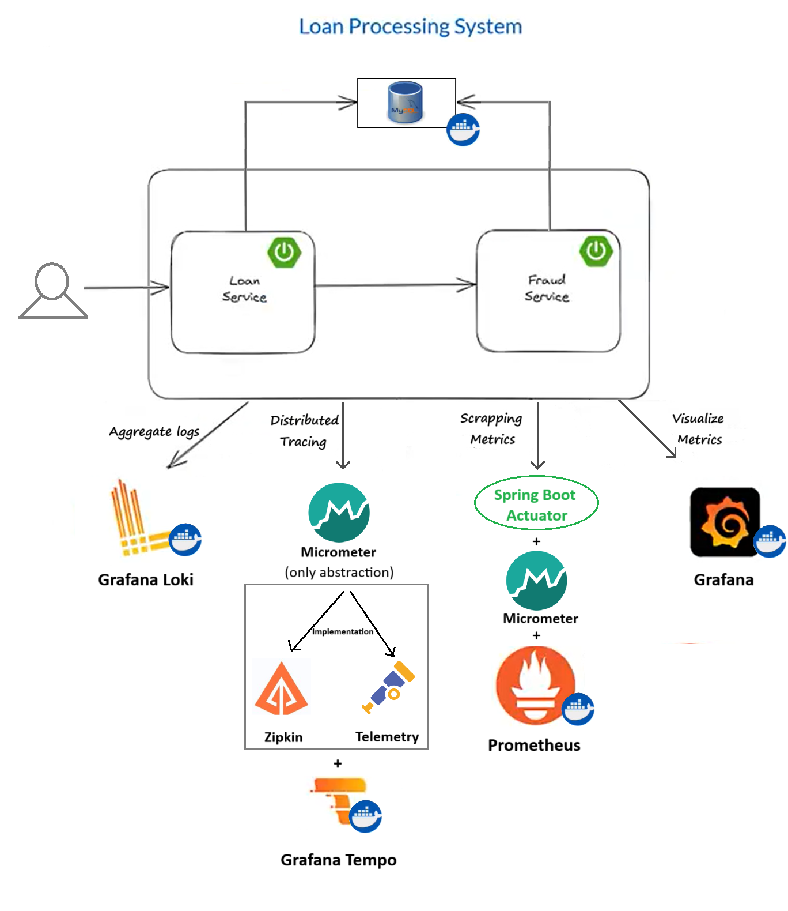

This repository contains source code for Spring Boot 3 Observability with Grafana Stack - Loki, Tempo, Prometheus, Grafana  
https://www.youtube.com/watch?v=PT2yZTBnUwQ  
https://programmingtechie.com/articles/spring-boot3-observability-grafana-stack

--------------------------------------------------------------------------------------------------------------  
# initial-commit branch

Initial micro-services code is checked-in into "initial-commit" branch (without observability):  

git clone https://github.com/LokeshJavaTech/micro-services-observability.git --branch initial-commit  
cd micro-services-observability  
docker compose up -d  

Start FraudDetectionServiceApplication  
1. GET endpoint to check fraud status by customer id: http://localhost:8081/fraud/check?customerId=101  

Start LoanServiceApplication  
1. POST endpoint to create a new loan request: http://localhost:8080/loan  
{  
"customerName" : "John",  
"customerId" : "100",  
"amount" : 10000,  
"currency" : "USD"  
}  
2. GET endpoint to get all loan requests: http://localhost:8080/loan
--------------------------------------------------------------------------------------------------------------  
# master branch

git clone https://github.com/LokeshJavaTech/micro-services-observability.git --branch master
cd micro-services-observability  

We can see all the actuator data on below endpoints:  

loan-service:  
http://localhost:8080/actuator/health  
http://localhost:8080/actuator/info  
http://localhost:8080/actuator/metrics  
http://localhost:8080/actuator/prometheus  

fraud-detection-service:  
http://localhost:8081/actuator/health  
http://localhost:8081/actuator/info  
http://localhost:8081/actuator/metrics  
http://localhost:8081/actuator/prometheus  

Grafana URL: http://localhost:3000/

| Application | Usage                | Details                                                        |
|-------------|----------------------|----------------------------------------------------------------|
| Loki        | Aggregates log       | logback logging framework                                      |
| Tempo       | Distributed tracking | Micrometer + (Open Zipkin OR Open Telemetry) + Tempo           |
| Prometheus  | Scrap Metrics        | Spring Boot Actuator + Micrometer + Prometheus                 |
| Grafana     | Visualize Metrics    | Uses all 3 data sources (Loki, Tempo, Prometheus) to visualize |

 

**Logging**

Spring boot application uses logback logging framework (logback-spring.xml) to send logs to Loki.
1. Download Loki (Docker image grafana/loki:main) and run it (Loki runs on port 3100)
2. Enable our application to send logs to loki:
   - Add loki-logback-appender dependency --> It adds necessary integration between our App and Loki with the help of logback logging library.
   - Add /src/main/resources/logback-spring.xml

 

**Tracing**

1. Add tracing information to all the outgoing calls to REST template:
   1. Enable distributed tracking using Micrometer. --> micrometer-tracing-bridge-brave dependency
   2. Micrometer creates the Traces.
   3. Micrometer is like a facade and uses either of below implementations:
      - Open Zipkin Brave Project
      - Open Telemetry
   4. Report the tracing info to Tempo --> zipkin-reporter-brave dependency
   5. Configure property: management.tracing.sampling.probability=1.0

2. Add tracing information to database call:
   1. Add dependency: datasource-micrometer-spring-boot
   2. Add observation on the repository we want to add tracing using @Observed annotation
   3. Enable observation using Aspect programing --> Observation config + AOP dependency

3. Setup Tempo:
   1. Download Tempo (Docker image grafana/tempo:2.2.2) - Tempo listening on port 3200
   2. Add tempo configuration file at /docker/tempo/tempo.yml
   3. Tempo runs on port 3100 + Tempo internally using zipkin, and zipkin runs on port 9411

 

**Metrics**

Metrics can be any kind of measurable information about our application like: JVM statistics, Thread count, Heap memory statistics etc.
1. Enable Spring Boot Actuator to collect metrics of our application --> By adding its dependency
2. Enable Micrometer. It gathers the metrics and expose an endpoint that will be used by Prometheus. (Spring boot uses Micrometer to collect metrics) --> by adding its dependency
3. Configure actuator and micrometer properties:
   1. Exposes endpoints through the actuator
      - management.endpoints.web.exposure.include=health, info, metrics, prometheus
   2. micrometer gathers the metrics in the form of a histogram and send it to Prometheus
      - management.metrics.distribution.percentiles-histogram.http.server.requests=true
      - management.observations.key-values.application=loan-service
4. Now we can see the metrics exposed by micrometer at: http://localhost:8080/actuator/prometheus or http://localhost:8081/actuator/prometheus
5. Download Prometheus (Docker image prom/prometheus:v2.46.0) and run it (Prometheus runs on port 9090)
6. Configuration prometheus.yml file, to tell Prometheus where it can find the necessary metrics to scrape

 

**Grafana**

To Setup Grafana:
1. Download Grafana (Docker image grafana/grafana:10.1.0)
2. Add grafana configuration file at /docker/grafana/datasources.yml - To define all the datasources Grafana will use to Visualize:
   - Loki - accessible at 3100
   - Trace - accessible at 3200
   - Prometheus - accessible at 9090
3. Grafana is accessible using browser: http://localhost:3000/
